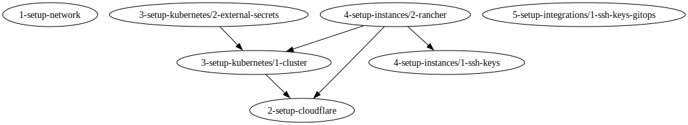

<!-- BEGIN_TF_DOCS -->
<a name="readme-top"></a>

## ➤ Setup <a name="#-setup"></a>

- Terraform to set up the network on Scaleway
- Terraform to set up DNS zone, DNS records, firewall rules and others in Cloudflare
- Terraform to create a Scaleway Kubernetes kapsule
- Terraform to configure IAM rules to integrate external secrets and secrets manager into Scaleway
- Terraform to create SSH keys used to access Scaleway instances
- Terraform to create a Scaleway Rancher Instance
- Terraform to create Rancher cluster, Rancher projects and Rancher namespaces
- Terraform to setup SSH keys for GitOps process in GitHub and GitLab

To configure your system for the development of this project, follow the steps below:

- Install [asdf](https://asdf-vm.com/) to manage runtime dependencies.
- Install runtime dependencies.

```bash
cut -d' ' -f1 .tool-versions | xargs -I{} sh -c 'asdf plugin add "$1"' -- {}
asdf install
```

- Run task from the root of the repository to see available commands. We use task in place of make for this project. See [Taskfile.yml](Taskfile.yml) for more information.

## ➤ Steps <a name="#-steps"></a>

- Go to `0-infrastructure` folder and run `terragrunt run-all apply`

## ➤ Ideas <a name="#-ideas"></a>

- Terraform to create a GitLab group structure + approval policies

## ➤ Dependencies <a name="#-dependencies"></a>

<div align="center">

</div>

## ➤ Tools <a name="#-tools"></a>

- kubectl
- helm
- helmfile
- terraform
- terragrunt

## ➤ Price <a name="#-price"></a>

- Cloudflare: $10.00 per mouth

## ➤ Links <a name="#-links"></a>

- https://forum.gitlab.com/t/deploy-keys-api-needs-admin-access/34814/6
- https://github.com/databus23/helm-diff
- https://clienttest.ssllabs.com
- https://engineering.deptagency.com/best-practices-for-terraform-aws-tags
- https://dnschecker.org/

<p align="right">(<a href="#readme-top">back to top</a>)</p>
<!-- END_TF_DOCS -->
